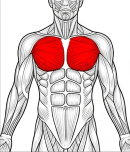
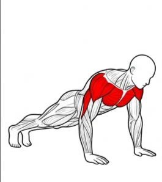
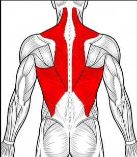
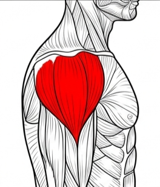
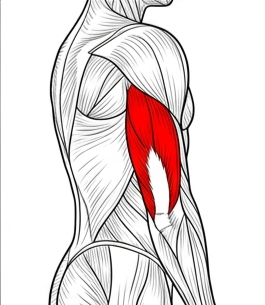
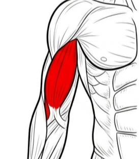
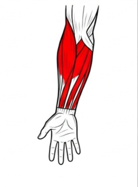
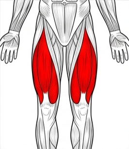
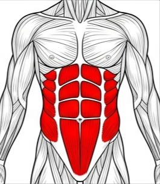

#  Real-Time AI Fitness Tracker: Crush Your Workouts with AI! 

Get pumped for the **Real-Time Fitness Tracker**—a game-changing app built with Python, MediaPipe, and OpenCV that tracks a huge variety of exercises with laser-sharp accuracy! This isn't just about counting reps—it's about nailing perfect form.

##  Why This Project Is a Total Game-Changer

- **Modular & Dedicated Exercise Logic**: Exercises are cleanly separated into dedicated scripts to ensure absolute precision.
- **Strict Form & Half-Rep Detection**: The AI enforces strict range-of-motion. “Half-reps” or bad posture trigger bold visual warnings.
- **Comprehensive Muscle Group Support**:
  - **Chest (صدر)**: Flat, Incline, and Decline Bench Presses, plus Push-Ups.
    <br> 
  - **Back (ظهر)**: Pull-Ups, Rows, Deadlifts.
    <br>
  - **Shoulders (كتف)**: Front Raise, Lateral Raise, Rear Delt Fly.
    <br>
  - **Arms (الذراع)**: Biceps Curls, Tricep Extensions, Forearm Curls.
    <br>  
  - **Legs (رجل)**: Front Squats, Hamstring/Back Curls, Lunges, Calf Raises.
    <br>
  - **Core (بطن/بلانك)**: Sit-ups, Planks.
    <br>
- **Live Stats**: Joint angles, rep counts, and real-time exercise stage (e.g., ’going up’, ’going down’) flash on-screen.


###  New Clean Project Structure

Exercises are deeply organized by targeted muscle groups under the `exercises/` folder!

```
|-- exercises/
|   |-- abs/          (Sit-ups - تمارين البطن)
|   |-- arm/          (Biceps, Triceps, Forearms - تمارين الرداع)
|   |-- back/         (Pull-ups, Rows, Deadlifts - تمارين الظهر)
|   |-- chest/        (Flat, Incline, Decline, Push-ups - تمارين الصدر)
|   |-- leg/          (Front Squats, Curls, Calf Raises, Lunges - تمارين الأرجل)
|   |-- plank/        (Planks - بلانك)
|   |-- push_up/      (Push-ups - ضغ۷)
|   |-- shoulder/     (Front/Lateral Raises, Rear Delts - تمارين الكتف)
|-- requirements.txt
|-- README.md
```
*(Every folder has an `info.txt` file listing its exercises in English and Arabic!)*

##  Tech Stack That Packs a Punch

- **Python 3.8+**: The powerhouse behind the magic.
- **OpenCV**: Delivers slick video processing and visuals.
- **MediaPipe**: Rocks cutting-edge pose estimation.
- **NumPy**: Crunches numbers for pinpoint angle calculations.

### Get Started

### 1. Prerequisites 
- Camera (Webcam or external)

### 2. Install Dependencies

Pip install opencv-python mediapipe numpy


##  How to Use It

1. **Activate the Virtual Environment** (if you have one):
   powershell .\.venv\Scripts\Activate.ps1

2. **Launch an Exercise**:
   Pick your workout and run the script straight from the `exercises` directory:
   python exercises/shoulder/lateral_raise.py

   Or for Squats:
   python exercises/leg/front_squat.py
    
3. **Crush Your Set**:
   - Make sure your full body (or at least the target joints) is visible in the camera frame.
   - The AI measures your angles dynamically! If you cheat, it will yell at you. 
   - Press `q` to quit your session.


**Time to sweat, track, and conquer!** 